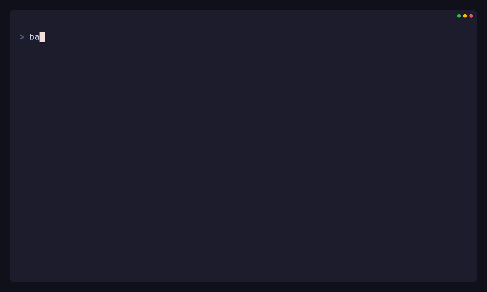

# PHP Upgrade Preflight

> [!IMPORTANT]
> **Project status: Public beta.** PHP Upgrade Preflight is open source under the [MIT License](LICENSE), free for commercial and noncommercial use.

PHP Upgrade Preflight checks a planned PHP upgrade before you change your project. It works with Composer-based projects, copies `composer.json` and `composer.lock` into temporary workspaces, and runs Composer checks there. It also scans your source files. You get a JSON report, or a Markdown version of that report.

v0.3 runs on PHP `^8.0`, from PHP 8.0 through PHP 8.x. The Laravel adapter gives upgrade guidance for Laravel 7 to 8, direct 7 to 9, and every upgrade from one major version to the next, from 8 to 9 through 12 to 13.

If your project's root `composer.json` requires `laravel/framework`, the analyzer can also check dependencies one major version at a time along any path within Laravel 7–13 that skips no versions. It reports each step separately from the direct check for your final target.

You can install the Laravel adapter alongside Laravel 8 on PHP 8.0, Laravel 9 on PHP 8.0.2, Laravel 10 on PHP 8.1, Laravel 11/12 on PHP 8.2, and Laravel 13 on PHP 8.3. The analyzer's PHP requirements are separate from those of the upgrade you're checking. When you run it outside the project, it can use Composer platform settings to model a newer target.

## Public beta and compatibility

Patch releases in v0.3.x keep the existing public contracts compatible. This covers how you run an analysis from PHP, the CLI and Artisan commands, required adapter interfaces, metadata used to discover adapters, exit codes, and report schema `0.8`. Supported upgrade paths and step-by-step analysis also stay compatible. Bug fixes, security fixes, and corrections to evidence may still change individual findings or diagnostics.

v0.3.5 is the latest published release. Its reports show tool version `0.3.5` and schema `0.8`, the same schema used in v0.3.0. Development on `main` uses `0.3.x-dev` Composer aliases with `^0.3` internal dependency constraints. The [readiness decision](docs/readiness/release-direction.md) defers Symfony while reader benefit, real-project operating cost and maintainer capacity are evaluated. The development-tree safety and report-clarity work is unreleased; no new schema, package or v0.4 scope is approved by that decision.

The earlier `0.2.x` and `0.1.x` lines are archived. Their signed release files remain available and unchanged, but those versions receive no further features, bug fixes, or security fixes. See [Project status and licensing](docs/project-status.md) for the upgrade path.

Use the report to plan the upgrade. When Composer finds a set of dependencies that fit together, you still need to test the application. The analyzer doesn't apply the upgrade or run your code, and it can't prove that the application will work or deploy successfully. Public beta doesn't mean the tool is ready for production use. Review every report and check the upgrade with your application's tests and deployment process. See [Project status and licensing](docs/project-status.md), [Versioning](docs/versioning.md), and [Limitations and trust boundaries](docs/limitations.md).

## Install

If your project still runs PHP 7, or you need to keep every byte of its files unchanged, install the CLI and Laravel adapter in a separate tools directory:

```bash
mkdir php-upgrade-tools
cd php-upgrade-tools
composer require php-upgrade-preflight/cli:^0.3 php-upgrade-preflight/laravel:^0.3
```

Use this separate Composer tools directory to run the analyzer outside your project. v0.3 doesn't ship or support a PHAR or a versioned container image. The Docker files in this repository are for development.

For a project already running PHP 8.0 or later, you can install both packages as development dependencies:

```bash
composer require --dev php-upgrade-preflight/cli:^0.3 php-upgrade-preflight/laravel:^0.3
```

See [Installation](docs/installation.md) and [External analysis](docs/external-analysis.md) for package choices, Windows commands, and the PHP 7.4 workflow.

## Run an analysis

The wizard walks you through the options. It detects your project, asks which PHP version you use now and which version you're targeting, checks your package targets, and shows a command you can reuse:

```bash
vendor/bin/upgrade-intel wizard
```


You answer the wizard's prompts one line at a time. By default, it shows a Markdown report in the terminal. You can also save an identical copy outside the project you're checking.

The wizard first looks for packages in your local `composer.json`. You can choose to look in the local cache or configured repositories too. Before a repository lookup, it warns that the lookup may use the network or credentials from your environment.

Before running the analysis, you must choose restricted or compatible Composer execution. The wizard shows what that choice means for network access and credentials in the plan you review. It also adds the matching `--composer-mode` option to the command you can reuse.

For scripts and CI, use the non-interactive command and set the options explicitly. `--save-report=PATH` saves a copy and still prints the report to stdout. `--output=PATH` writes the report only to a file:

```bash
vendor/bin/upgrade-intel analyze \
  --path=/projects/legacy-app \
  --from-php=7.4 \
  --target=laravel/framework:^9.0 \
  --target-php=8.1 \
  --framework=laravel \
  --format=json \
  --output=/projects/reports/legacy-app.json
```

With the adapter installed in a Laravel application, you can also use Artisan:

```bash
php artisan upgrade:analyze \
  --from-php=7.4 \
  --target=laravel/framework:^9.0 \
  --target-php=8.1 \
  --format=markdown \
  --output=/projects/reports/legacy-app.md
```

The analyzer returns `0` when it produces a valid report, even if `resolution.status` is `blocked` or `unknown`. In scripts and CI, read that field to see whether Composer found a solution for the direct upgrade. Exit code `0` means the report was produced successfully.

### Five-minute offline demo

The [Laravel 10 to 13 demo](examples/five-minute-demo/README.md) runs real Composer dependency checks offline, using local path repositories. It gives repeatable results and a schema `0.8` report to read alongside the terminal output.

The report shows the direct check for Laravel 13, framework guidance, and step-by-step dependency checks separately. It tracks two blockers at 10→11 and shows how each develops across the steps. The middle step has a dependency solution, and fingerprints track the selected candidate states carried into the next step. The 12→13 step stops on a different extension blocker and also flags something to review in the original source.

The deprecated CSRF aliases still exist, so the advice about them doesn't mean a symbol has been removed. Before-and-after hashes of every target file verify that the project stayed unchanged.



## Read-only analysis

The analyzer reads your project without changing its files. Composer runs only in temporary workspaces, with scripts and plugins disabled. Report paths passed to `--output` must be outside the project you're checking. Tests save a snapshot of every fixture file before a run and check that every byte is unchanged afterwards.

Composer's stdout, stderr, diagnostics, and command failure messages are checked for known secrets before they reach a report or the console. The redaction rules replace URLs containing credentials, authorisation values, common token formats, and named credential fields with consistent markers. Release CI also checks generated reports and archives using synthetic test secrets.

These rules don't restrict what Composer can access. It can still read its configured credentials and contact declared repositories. Workspaces kept for debugging contain copies of the Composer manifests, and the redaction rules can't recognise every possible secret format. Give credentials only the access they need, isolate untrusted projects, and review reports before sharing them.

The analyzer uses exact file paths internally. In the default shareable JSON and Markdown reports, it replaces absolute local root paths with consistent markers:

- `[PROJECT_ROOT]` for the analyzed project.
- `[REPORT_OUTPUT]` for the report destination.
- `[LOCAL_REPOSITORY]` for local Composer repositories.
- `[ANALYZER_WORKSPACE]` for the analyzer's temporary workspace roots.

Source file paths in the report stay relative to your project.

Use `--debug` when you need to inspect the temporary workspaces. It keeps them and includes exact `temp_path` values in the report, so don't share debug reports or those workspaces. Without `--debug`, errors during workspace cleanup show only `[ANALYZER_WORKSPACE]`. Secret redaction stays active in every mode.

## Reports

JSON defines the report data. The Markdown version is generated from it. The published v0.3.x line uses schema `0.8`. v0.2.1 used schema `0.7`, and v0.1 used schema `0.6`. Reports include:

- the commands run for each scenario, Composer results, diagnostics, and hashes that identify candidate lockfiles.
- a safe record of how Composer ran, including compatible/restricted mode, expected version, timeouts, what it inherited from the environment, and offline policy.
- where platform assumptions came from and which decisions may depend on the host.
- package changes, structured blockers, source usages found by the scanner, and source impact that calls for action, linked to Composer autoload ownership.
- framework upgrade guidance and findings for each step.
- separate results for the direct upgrade and the step-by-step checks, including each step and attempt, fingerprints that identify selected states, how blockers develop, and changes for each step. Source findings use the original project snapshot.
- actions for each stage, test guidance, risk and effort estimates, uncertainties, and links to the evidence.

Schema `0.8` adds the required `staged_resolution` field. The direct `resolution` field and framework guidance still mean what they meant in schema 0.7. If your code reads reports from multiple versions, check [JSON schema and compatibility](docs/schema.md) and the [v0.3 staged-analysis contract](docs/v0.3-contract.md).

Read the Markdown **Decision Summary** before the Composer transcripts. It projects the direct and staged outcomes, first recorded blocking subject and evidence, plan actions, assessment limits, and manual validation from the JSON report. Use the [five report-state reading checklists](docs/readiness/report-reading-checklists.md) to choose the next safe action. A `low` risk grade describes observed drivers only; an unknown or degraded Composer result, skipped stage, source-scan omission, or adapter failure is not a verified low-risk upgrade. `risk.drivers`, `effort.assumptions`, and `uncertainties` qualify those cases in canonical JSON too. The hour range is an uncalibrated planning heuristic for observed dependency, source, and test work, not a project quote. Unobserved migration, deployment, runtime, and business validation work is excluded. An unavailable input report's `0-0` hours means **not estimated**, not no work.

Staged hop, attempt, process, and timeout limits are enforced. The `budgets` memory and report-size values are advisory targets; schema `0.8` records no per-run peak-memory or advisory pass result. Missing measurements are unknown, never zero or a successful check.

Laravel guidance covers 7→8, the direct 7→9 path, and every upgrade from one major version to the next, from 8→9 through 12→13. For an upgrade across several major versions, the rule catalogue must cover every required step. Advice stops at the first gap.

Guidance isn't supported when the current or target major version is unclear or unknown, when both are the same, or when you're downgrading. It also isn't supported outside Laravel 7–13 or when the first required step is missing from the catalogue.

In schema 0.8, read these three fields separately:

- `transition.framework_guidance[].status` tells you whether the rules cover the upgrade path.
- `resolution.status` tells you whether Composer found a solution for the direct upgrade.
- `staged_resolution.status` reports the result of the step-by-step dependency checks.

Six Laravel test projects model application structures and have approved JSON and Markdown snapshots in [`packages/laravel/tests/Snapshots`](packages/laravel/tests/Snapshots). CI runs the same suite on Ubuntu and Windows.

## Packages

- `php-upgrade-preflight/core` runs the analysis and defines the report data.
- `php-upgrade-preflight/cli` provides the non-interactive `upgrade-intel analyze` command and the interactive `upgrade-intel wizard` workflow.
- `php-upgrade-preflight/laravel` provides Laravel detection, rules, and `upgrade:analyze`.

Third-party adapters register through Composer metadata. They can detect frameworks, choose source paths, supply rules, and group related packages without changes to the CLI. See [Framework adapters](docs/adapters.md).

## Documentation

- [Installation](docs/installation.md)
- [External analysis](docs/external-analysis.md)
- [Framework adapters](docs/adapters.md)
- [CLI reference](docs/cli.md)
- [Artisan reference](docs/artisan.md)
- [Composer execution policy](docs/composer-execution.md)
- [JSON schema and compatibility](docs/schema.md)
- [Project status and licensing](docs/project-status.md)
- [v0.2 report and transition contract](docs/v0.2-contract.md)
- [v0.3 staged-analysis contract](docs/v0.3-contract.md)
- [v0.3.5 release notes](docs/releases/v0.3.5.md)
- [v0.3.0 release notes](docs/releases/v0.3.0.md)
- [Laravel v0.2 transition scope](docs/laravel-v0.2-transition-scope.md)
- [Laravel coverage review and manual migration checks](docs/laravel-coverage/README.md)
- [Limitations and trust boundaries](docs/limitations.md)
- [Troubleshooting](docs/troubleshooting.md)
- [Contributing](CONTRIBUTING.md)
- [Security policy](SECURITY.md)
- [Changelog](CHANGELOG.md)
- [Versioning policy](docs/versioning.md)

## Development

The Docker environment runs PHP 8.5. Composer checks development dependencies against PHP 8.0.30 to keep them compatible with the lowest supported PHP version. [Current compatibility coverage](docs/current-compatibility.md) lists the PHP and ecosystem versions tested, checks of projects using these packages, and limits of PHP 8.6 preview coverage.

```bash
docker compose build --pull php
docker compose run --rm php composer install
docker compose run --rm php composer check
```

`composer check` runs repeatable checks offline. It validates every package manifest, runs the unit, integration, and smoke PHPUnit suites, runs static analysis, and checks formatting. Compatibility installs against live repositories and dependency audits run in separate workflows. See [CONTRIBUTING.md](CONTRIBUTING.md) for `test:unit`, `test:integration`, `test:smoke`, and `test:all`, tests for individual packages, and snapshot updates.

## License

Copyright 2026 Valentin Nikolaev. PHP Upgrade Preflight is open source under the [MIT License](LICENSE).

Releases up to and including v0.3.1 were published under the PolyForm Noncommercial License 1.0.0. Those releases still use the license they shipped with. The MIT License applies to this repository and every release published after v0.3.1. If this summary and the license differ, follow the license text.
