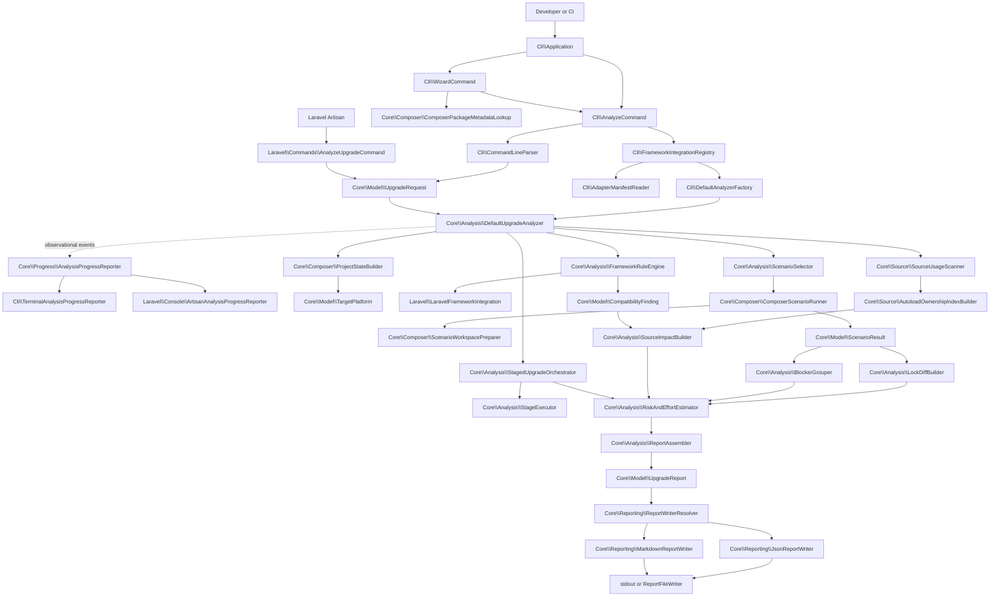

# Architecture Overview

PHP Upgrade Preflight helps plan a PHP or Composer upgrade. It reads the project's Composer files and selected PHP source, runs bounded Composer probes in temporary workspaces, and reports what the evidence supports. It leaves the analyzed project alone. A successful probe still says nothing conclusive about whether the application runs correctly after the upgrade.

## Audience

Use this page to see how the parts fit together. For package ownership, see [[Package Map|Package-Map]]. For a class lookup, see [[Core Service Reference|Core-Service-Reference]].

## System context

The repository contains three production packages and two fixture packages.

| Package | Architectural role |
| --- | --- |
| `php-upgrade-preflight/core` | Framework-neutral analysis engine and report model |
| `php-upgrade-preflight/cli` | Generic command-line boundary and adapter discovery |
| `php-upgrade-preflight/laravel` | Laravel knowledge, source visitors, stages, and Artisan integration |
| `php-upgrade-preflight/test-adapter` | Current third-party adapter contract fixture |
| `php-upgrade-preflight/legacy-test-adapter` | Older adapter capability fixture |

Dependencies point toward Core. Core exposes interfaces and models. Laravel and other adapters implement them without bringing framework code into Core.

## End-to-end pipeline

The following Mermaid diagram uses the real production class names.



The diagram shows possible work. Optional branches run only when their inputs and adapter capabilities are available. With no active stage provider, for example, Core skips staged analysis.

## Layer 1: delivery boundaries

There are three user-facing command flows over two executables.

The generic executable offers automation-safe `upgrade-intel analyze` and terminal-only `upgrade-intel wizard` flows. `Cli\Application` dispatches them. `Cli\AnalyzeCommand` owns explicit option parsing and delivery. `Cli\WizardCommand` collects choices, validates optional package metadata, prints the equivalent explicit command, and delegates back to the same analyzer command.

`Cli\AnalyzeCommand` handles the generic analysis flow. Laravel exposes `php artisan upgrade:analyze` through `Laravel\Commands\AnalyzeUpgradeCommand`.

The standalone analysis and Artisan controllers perform the same broad work:

1. Parse command input.
2. Construct validated model objects.
3. Delegate to `UpgradeAnalyzer`.
4. Select a report writer.
5. Print or write the rendered report.

They leave conflict parsing and risk assessment to Core, and Laravel transition rules to the adapter. A command's job is to turn input into a request and deliver the resulting report.

Terminal progress follows the same boundary. Core emits validated observational events through `AnalysisProgressReporter`. CLI and Laravel render them to terminal-attached stderr. Non-TTY execution stays silent, and progress reporter failures cannot affect the canonical report.

## Layer 2: request model

`UpgradeRequest` checks the inputs before analysis starts.

It contains:

- project path
- package targets
- current PHP evidence
- target PHP
- source paths
- requested frameworks
- report format and output path
- debug mode
- extension assumptions
- optional target-platform profile
- Composer execution configuration.

`UpgradeTargetSet` normalizes package and PHP targets. Repeated package targets cannot conflict, PHP values from different inputs must agree after normalization, and source paths must stay inside the analyzed project.

## Layer 3: project state

`ProjectStateBuilder` loads `composer.json` and `composer.lock` through `JsonFileReader`, which requires JSON objects. It returns a `ProjectStateLoadResult`: either a `ProjectState` or a typed failure with enough partial state for a terminal report. Bad input is reported as bad input, not as a Composer conflict.

## Layer 4: target platform

`TargetPlatform::fromRequest()` combines the request with project Composer metadata. It records PHP, extensions, profile packages, and where each value came from. A caller's extension assumption describes the intended target. The analyzer has not booted that environment to confirm it.

## Layer 5: adapter activation

The generic CLI discovers adapter classes from installed Composer manifests.

`AdapterManifestReader` reads:

```json
{
  "extra": {
    "php-upgrade-preflight": {
      "framework-adapters": ["Vendor\\Adapter\\Integration"]
    }
  }
}
```

`FrameworkIntegrationRegistry` constructs integrations that need no required arguments and rejects duplicate classes or names that differ only by case. `FrameworkRuleEngine` activates explicitly requested, available `--framework=name` integrations. Without that option, each integration's project detection decides whether it applies.

## Layer 6: direct Composer scenarios

`ScenarioSelector` creates a bounded scenario matrix.

The usual scenarios are:

- baseline validation
- exact target
- target with all dependencies
- minimal changes.

PHP plus package requests may add platform-only and staged-target diagnostic scenarios.

`ComposerScenarioRunner` executes each selected scenario.

It uses `TemporaryWorkspaceManager` and `ScenarioWorkspacePreparer`.

Only the temporary workspace receives the changed Composer files.

Each scenario returns a `ScenarioResult`.

A result can contain:

- exit code
- bounded stdout and stderr
- duration
- Composer version
- failure classification
- diagnostics
- candidate lock state
- candidate lock evidence
- debug workspace path.

## External-process boundary

Composer is an external process.

Its environment, version, repositories, cache, credentials, and network availability can affect results.

The report records relevant execution configuration and uncertainty.

Compatible mode uses normal Composer access with non-interactive/no-audit settings.

Restricted mode creates analyzer-owned Composer state and disables normal credential, proxy, prompt, and network paths where supported.

Restricted mode does not isolate the process at the operating-system level.

## Layer 7: direct interpretation

`LockDiffBuilder` compares the baseline lock with the selected successful candidate.

`BlockerGrouper` converts reliable solver evidence into structured blockers.

`ComposerBlockerParser` helps extract package and constraint relations from Composer text.

`AbandonedPackageDetector` adds lock-metadata abandonment evidence.

The direct resolution can be:

- `feasible`
- `feasible_with_changes`
- `blocked`
- `unknown`.

`unknown` means Core lacks reliable solver evidence. It does not mean Composer found a conflict.

## Candidate selection

The analyzer considers successful target-feasibility scenarios with readable candidate locks.

It first prefers fewer package changes.

For equal change counts, strategy rank is:

1. exact target
2. minimal changes
3. with all dependencies.

Original scenario order is the final tie-breaker.

This candidate drives the direct lock diff.

## Layer 8: staged analysis

Staged analysis is separate from direct resolution.

`StagedUpgradeOrchestrator` asks active `FrameworkStageTargetProvider` integrations for plans.

`StagePlanResolver` validates and selects a usable provider plan.

`StageAttemptPlanner` creates bounded attempts.

`StageExecutor` runs them.

`StageBlockerRegistry` tracks conflict lifecycle.

The selected candidate state of one successful stage becomes input to the next stage.

Staged dependency candidates do not rewrite application source.

## Layer 9: source analysis

`SourceUsageScanner` parses selected PHP files using `nikic/php-parser`.

Core visitors collect common declarations and usages.

Adapters may add visitors through `SourceUsageVisitorProvider`.

The scanner first records what it sees. A source usage becomes actionable impact only after correlation with ownership, package changes, or framework findings.

`AutoloadOwnershipIndexBuilder` uses root and locked-package autoload metadata.

`SourceImpactBuilder` correlates inventory with ownership, package changes, and framework findings.

This reduces false attribution caused by matching a symbol name alone.

## Layer 10: framework guidance

Adapters supply maintained framework knowledge.

The Laravel adapter separates that knowledge into:

- `LaravelFrameworkDetector`
- `LaravelRuleCatalog`
- `LaravelRuleFactory`
- `LaravelTransitionAssessor`
- `LaravelStagePlanner`
- `LaravelSourceUsageVisitor`.

Core sees interfaces and model values, not Laravel implementation details.

See [[Laravel Package Internals|Laravel-Package-Internals]].

## Layer 11: assessment

`RiskAndEffortEstimator` consumes structured evidence.

Risk is a deterministic planning summary, not a probability. Effort is a range with confidence, components, and assumptions, not a delivery promise.

`StageAssessmentBuilder` adds stage-level source impact, risk, effort, tests, and actions.

## Layer 12: report assembly

`ReportAssembler` is the single normal construction point for `UpgradeReport`.

`ReportSectionBuilder` creates normalized derived sections.

The report constructor validates evidence references and other invariants.

JSON carries the canonical report. Markdown renders the same report for people. Neither writer reruns analysis.

## Trust boundaries

| Boundary | Untrusted or variable input | Main controls |
| --- | --- | --- |
| CLI | User-provided strings and paths | Parser and model validation |
| Project files | Composer JSON and PHP source | Strict readers, AST parser, contained uncertainties |
| Composer | External executable and output | Timeouts, safe command representation, classification, redaction |
| Adapters | Third-party classes and rules | Manifest validation, interface checks, exception containment |
| Reports | Paths, diagnostics, evidence context | Path markers, structured redaction, bounded excerpts |

## Failure containment

Not every failure ends the process.

A broken optional adapter manifest is skipped and diagnosed.

A throwing adapter rule becomes evidence-backed uncertainty while remaining rules continue.

A failing stage provider can be contained as unavailable staged analysis.

A PHP parse failure becomes source uncertainty.

An invalid command invocation exits before analysis.

An unreadable project input produces a terminal input-failure report when possible.

## Architectural invariants

- The analyzed project is not mutated.
- Candidate manifests and locks belong to analyzer workspaces.
- JSON is the canonical contract.
- Every registered evidence item must support a report claim.
- Framework-specific knowledge stays outside Core.
- Operational failure is not reported as a solver blocker.
- Unknown remains a first-class outcome.
- Stable ordering is deliberate, not accidental.
- Sensitive output is redacted before sharing.
- Debug mode weakens path hiding by explicit user choice.

## Example request path

```bash
vendor/bin/upgrade-intel analyze \
  --path=./shop \
  --target=laravel/framework:^13.0 \
  --from-php=8.2 \
  --target-php=8.3 \
  --framework=laravel \
  --format=json
```

The CLI constructs the request and discovers Laravel. Core loads Composer state, models the target platform, and tests the direct target. Laravel may provide adjacent stage targets. Core scans the original source and keeps direct resolution, staged attempts, source impact, and framework guidance distinct in the report.

## Where to read next

- [[Core Package Guide|Core-Package-Guide]] for contributor workflows.
- [[Core Analysis Pipeline|Core-Analysis-Pipeline]] for a compact execution narrative.
- [[Core Service Reference|Core-Service-Reference]] for class ownership.
- [[Determinism and Evidence|Determinism-and-Evidence]] for stability and traceability.
- [[CLI Package Internals|CLI-Package-Internals]] for the generic command boundary.
