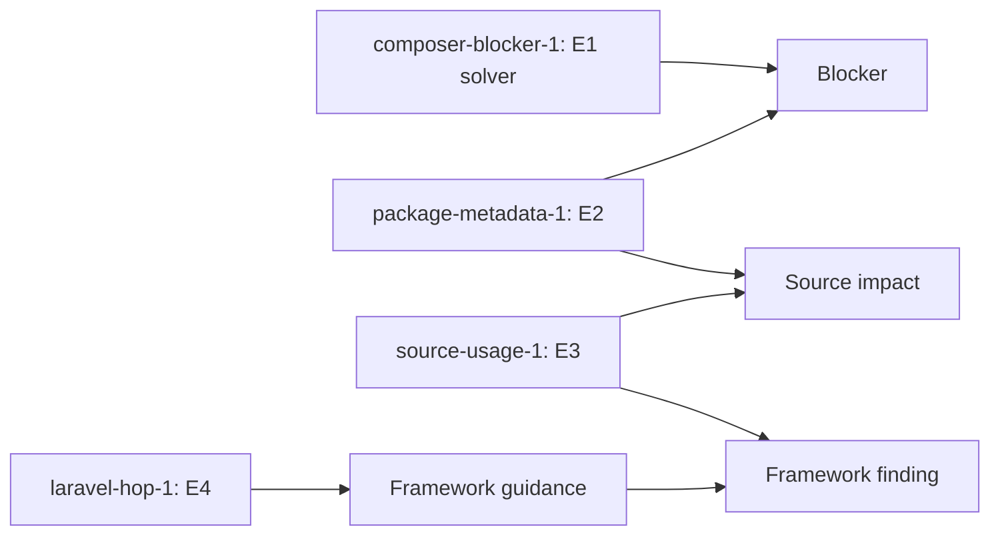

# Determinism and Evidence

PHP Upgrade Preflight is designed to produce traceable, stable planning output from the evidence available to one analysis run.

Deterministic does not mean omniscient.

It does not mean that Packagist, private repositories, Composer caches, executable versions, or network state are controlled automatically.

It means the tool normalizes the inputs and outputs it owns and records uncertainty for important limits it cannot remove.

## Why this matters

Developers need to reproduce a surprising finding.

Technical managers need to know whether two reports are comparable.

Automation needs stable fields, ordering, identifiers, and schemas.

Reviewers need to trace a conclusion back to evidence.

These needs are related but not identical.

## Four different ideas

| Idea | Meaning |
| --- | --- |
| Determinism | Equivalent controlled inputs and observations produce stable modeled output |
| Reproducibility | Another run can recreate sufficiently equivalent inputs and environment |
| Evidence | A structured record supporting a report claim |
| Confidence | How directly the available evidence supports that claim |

A deterministic heuristic remains a heuristic.

A high-confidence solver result can still depend on repository state.

A reproducible report can correctly contain `unknown`.

## Evidence classes

`Evidence` defines five classes.

| Class | Constant | Typical source | Example |
| --- | --- | --- | --- |
| E1 | `E1_SOLVER` | Composer solver/execution evidence | A reproducible dependency conflict |
| E2 | `E2_PACKAGE_METADATA` | Composer manifest or lock metadata | Locked version or root requirement |
| E3 | `E3_PROJECT_SOURCE` | Parsed project source | Symbol use at a file and line |
| E4 | `E4_MAINTAINER_DOCUMENTATION` | Maintained adapter knowledge with sources | Laravel upgrade-guide requirement |
| E5 | `E5_HEURISTIC` | Deterministic inference | Risk or planning hint based on modeled signals |

The class is not a ranking that automatically decides severity.

Severity describes impact.

Confidence describes support.

Evidence class describes source type.

## Evidence object

Every evidence item contains:

```json
{
  "id": "example-1",
  "class": "E2",
  "summary": "The lock file contains vendor/package 1.4.0.",
  "confidence": "high",
  "context": {
    "package": "vendor/package",
    "version": "1.4.0"
  }
}
```

The example shape matches `Evidence::toArray()`.

Evidence summaries and contexts are redacted during construction.

This prevents a later consumer from accidentally serializing the unredacted original.

## Evidence ledger

`EvidenceLedger` owns evidence registration for one analysis.

`add()` creates a new item.

Its namespace must match:

```text
^[a-z][a-z0-9_-]*$
```

IDs are namespace plus sequence.

```text
composer-blocker-1
composer-blocker-2
laravel-stage-target-1
```

Sequence is maintained separately per namespace.

Existing IDs are skipped when finding the next available sequence.

## `add()` versus `addOnce()`

Use `add()` when separate observations deserve separate evidence records.

Use `addOnce()` when content-identical evidence in one namespace should be reused.

`addOnce()` compares:

- evidence class;
- summary;
- confidence;
- context;
- namespace prefix.

It builds a SHA-256 content bucket from serialized values for efficiency.

It still applies strict equality to candidates in that bucket.

If a value cannot be serialized, it falls back to an exhaustive scan.

The fallback preserves behavior rather than changing deduplication semantics.

## Evidence ID stability

Evidence IDs are stable only when evidence creation order and content remain stable.

Adding a new earlier item in the same namespace can shift later sequence numbers.

Therefore:

- iterate inputs in deterministic order;
- use focused namespaces;
- avoid creating unused evidence;
- do not treat an evidence ID as a permanent database identity across schema changes.

Within one canonical report, IDs are precise foreign keys.

## Reference integrity

The report enforces both directions of evidence integrity.

First, every referenced ID must exist.

Second, every registered evidence item must be referenced.

`EvidenceLedger::validateReferences()` rejects missing references.

It also rejects orphan evidence.

`UpgradeReport` gathers references from:

- blockers;
- source inventory;
- actionable source impact;
- framework findings;
- framework guidance and hops;
- root constraint changes;
- staged resolution;
- plan stages;
- uncertainties that contain explicit evidence references.

This makes the ledger a support graph, not an appendix of unused observations.

## Example evidence graph



One item may support several claims.

One claim may cite several evidence items.

No evidence item may remain disconnected.

## Ordering as part of determinism

PHP arrays preserve insertion order.

That makes traversal order visible in JSON.

The code sorts at ownership boundaries where unordered input is possible.

Examples include:

- package names in `LockDiffBuilder`;
- package families attached to changes;
- installed integration names;
- framework guidance;
- source files in `SourceUsageScanner`;
- symbol declarations;
- autoload paths and files;
- ownership names and mapping types;
- relevant source-impact package maps;
- provider names in stage-plan conflict handling;
- platform decisions in fingerprints.

Do not rely on filesystem enumeration order.

Do not rely on Composer metadata object order when semantics are map-like.

## Lists versus maps

Not every array should be sorted.

A map has key-based semantics and can be canonicalized by key.

A list may encode meaningful priority or execution order.

Examples of meaningful list order:

- scenario order;
- stage order;
- attempt order;
- package dependency path;
- source occurrence order;
- report section order.

Sorting a meaningful list can change behavior.

Canonicalization must know the difference.

## Scenario determinism

`ScenarioSelector` constructs candidates in a fixed order.

It then deduplicates by an execution key containing:

- normalized targets;
- effective with-all-dependencies flag;
- minimal-changes flag.

Baseline validation has its own fixed key.

The selector does not run redundant scenarios merely because they have different display names.

## Candidate selection determinism

Successful target-feasibility candidates are ranked by:

1. package-change count;
2. strategy rank;
3. scenario index.

Strategy rank is exact target, then minimal changes, then with all dependencies.

This makes selection stable when multiple Composer strategies succeed.

The selected candidate determines the direct lock diff.

## Stable source scanning

`SourceUsageScanner` canonicalizes and sorts discovered file paths.

Visitors retain AST-derived line numbers and symbols.

`SymbolDeclarationVisitor` sorts declarations by symbol and type.

`AutoloadOwnershipIndexBuilder` sorts locked packages, paths, and files.

`SymbolOwnershipIndex` sorts owner names and mapping types.

These choices prevent operating-system directory iteration from changing report order.

## Cross-platform paths

Shareable reports should not depend on an absolute checkout location.

`PathExposurePolicy` replaces relevant roots with markers:

| Marker | Meaning |
| --- | --- |
| `[PROJECT_ROOT]` | Analyzed project root |
| `[REPORT_OUTPUT]` | Requested report destination |
| `[LOCAL_REPOSITORY]` | Local Composer repository reference |
| `[ANALYZER_WORKSPACE]` | Temporary analyzer workspace |

It recognizes path separator variants, escaped forms, and encoded forms.

Longer matching paths are processed before shorter ones.

This avoids a parent path hiding only part of a more specific path.

## Canonical report sanitization

`UpgradeReport::toArray()` builds the canonical array.

It then calls `PathExposurePolicy::sanitizeCanonicalReport()`.

Sanitization:

1. identifies project, output, and local-repository paths;
2. recursively replaces path occurrences;
3. forces known project and output fields to markers;
4. applies structured sensitive-output redaction.

Both keys and values can be redacted.

JSON-serializable objects are traversed safely.

Recursive object cycles produce a redacted marker instead of infinite recursion.

## Sensitive-value determinism

`SensitiveOutputRedactor` uses stable markers.

Examples are:

- `[REDACTED]`;
- `[REDACTED_TOKEN]`;
- `[REDACTED_URL]`;
- `[REDACTION_FAILED]`.

It recognizes Composer auth assignments, authorization headers, credential-bearing URLs, named credential fields, bearer/basic tokens, and common token formats.

Structured keys known to be sensitive cause their values to be withheld.

A regex failure returns a failure marker rather than leaking the original value.

## Bounded external output

Composer stdout and stderr are external and potentially large.

`OutputExcerpt::bounded()` truncates by byte budget while preserving valid UTF-8 boundaries.

Bounded output supports stable report sizes.

It also reduces accidental exposure surface.

Bounding does not replace redaction.

## Candidate lock evidence

`CandidateLockFileReader` fingerprints the bytes Composer wrote.

It normalizes CRLF and CR line endings to LF before SHA-256.

This avoids a candidate lock fingerprint changing only because of line-ending convention.

`CandidateLockEvidence` records:

- lowercase SHA-256;
- Composer `content-hash` when present;
- package count.

The byte fingerprint and semantic package data answer different questions.

## Project-state fingerprints

`ProjectStateFingerprint` identifies state used between staged analyses.

It records SHA-256 values for:

- manifest;
- lock;
- effective platform;
- execution policy;
- combined state.

Before hashing, it sanitizes private paths.

It canonicalizes map keys recursively.

It preserves list order.

It normalizes separators after exposure markers.

It excludes lock `content-hash` from the semantic lock digest.

## Why lock `content-hash` is excluded there

Temporary workspaces rewrite relative local repositories to absolute paths.

Composer can therefore write a location-dependent `content-hash`.

The manifest already has its own semantic fingerprint.

Keeping the derived lock field in the staged state fingerprint would make the same project state differ by temporary directory.

Candidate lock evidence still records the value Composer actually wrote.

## Platform fingerprinting

The platform digest includes:

- exact analysis PHP;
- whether the profile is closed-world;
- explicit semantic platform decisions.

Platform package decisions are sorted by package name.

In a complete profile, absent packages that are not toolchain-bound can be omitted from the digest because closed-world state already expresses their absence.

This prevents redundant representation from changing identity.

## Report serialization

`JsonReportWriter` calls `UpgradeReport::toArray()`.

It encodes with:

- pretty printing;
- unescaped slashes;
- exceptions on encoding failure;
- one trailing newline.

The top-level field order is controlled by `UpgradeReport`.

Schema version is controlled by `ReportMetadata::SCHEMA_VERSION`.

Consumers should validate the schema version before interpreting fields.

## Markdown projection

`MarkdownReportWriter` consumes canonical report data.

It does not run Composer or adapter rules.

Markdown formatting can differ while conclusions must remain equivalent to JSON.

If the formats disagree semantically, JSON and the schema remain canonical and the writer difference is a bug.

## Controlled and uncontrolled variables

| Variable | Controlled or recorded? |
| --- | --- |
| Normalized request | Controlled by model validation |
| Scenario order | Controlled by selector |
| Source file order | Controlled by scanner sorting |
| Composer executable/version | Configured and version evidence recorded when available |
| Repository metadata at a point in time | External; can change |
| Network availability | External; restricted mode can intentionally remove it |
| Private repository credentials | External and redacted |
| Host extension set | Not accepted as target truth unless represented by request/profile evidence |
| Temporary path | Normalized in shareable output |
| External process duration | Recorded but inherently variable |

Two reports can differ legitimately when an uncontrolled variable changes.

## Reading a changed report

When two runs differ, compare in this order:

1. `metadata.schema_version` and tool version;
2. normalized request summary;
3. Composer execution provenance;
4. platform provenance;
5. scenario outcomes and Composer version;
6. candidate lock fingerprint and package count;
7. project-state fingerprints for stages;
8. uncertainties;
9. evidence contexts;
10. final findings and assessments.

This identifies cause before debating the final risk label.

## Example: repository changed

Run A resolves `vendor/package` to `2.1.0`.

Run B resolves it to `2.1.1`.

The request can be identical.

The tool can still be deterministic relative to each observed repository state.

The candidate lock fingerprints reveal different external evidence.

Pinning repository content is a reproducibility responsibility outside the analyzer.

## Example: same project in another directory

One developer analyzes `/home/alex/shop`.

Another analyzes `D:\work\shop`.

Canonical reports use `[PROJECT_ROOT]`.

Portable staged fingerprints normalize path separators after markers.

Location alone should not manufacture a different semantic project state.

Debug paths can still differ when debug mode intentionally exposes them.

## Example: restricted mode

A compatible-mode run succeeds using cached credentials and network access.

A restricted-mode run cannot fetch a package.

Those runs have different execution policies.

The difference is real and should affect provenance or fingerprints.

Do not label the restricted operational failure as a dependency blocker.

## Confidence guidance

High confidence means evidence directly supports the modeled statement.

Medium confidence means useful support exists with material limits.

Low confidence means the conclusion is tentative.

Read the actual context and uncertainty.

Do not translate confidence labels to percentages.

Do not use confidence to erase contradictory evidence.

## Uncertainty as evidence discipline

Uncertainty is a required output when the system lacks reliable support.

Examples include:

- Composer executable unavailable;
- scenario timeout;
- source parse failure;
- unreadable candidate lock;
- incomplete platform evidence;
- current PHP unknown for a diagnostic scenario;
- adapter rule exception;
- stage guidance gap;
- workspace cleanup failure.

Recording uncertainty is more deterministic than guessing.

## Contributor rules

- Sort map-like external input before iteration.
- Preserve meaningful list order.
- Normalize paths before hashing or sharing.
- Use stable vocabulary constants.
- Create evidence at the observation boundary.
- Reference every created evidence item.
- Never reference an unregistered ID.
- Deduplicate only when semantic equality is proven.
- Keep external failures distinct from solver findings.
- Add snapshot tests when canonical output changes.
- Add cross-platform tests for path or fingerprint changes.
- Update schema and Wiki in the same behavior change.

## Review checklist for a new evidence type

1. Is the evidence class correct?
2. Is the namespace valid and specific?
3. Is creation order stable?
4. Is summary concise and factual?
5. Is context structured rather than embedded prose?
6. Are secrets and paths sanitized?
7. Does a report claim reference the ID?
8. Could identical observations use `addOnce()`?
9. Are confidence and severity kept separate?
10. Are schema and snapshots updated if shape changes?

## Review checklist for deterministic output

1. Is the input a list or a map?
2. If map-like, where is sorting owned?
3. If list-like, is order semantically documented?
4. Can filesystem order leak into output?
5. Can an absolute path leak into a digest?
6. Can line endings change a fingerprint?
7. Can external process noise change a stable field?
8. Is variable evidence recorded as provenance or uncertainty?
9. Does JSON retain canonical authority?
10. Do tests cover at least two input orderings?

## Related pages

- [[Architecture Overview|Architecture-Overview]]
- [[Core Package Guide|Core-Package-Guide]]
- [[Core Analysis Pipeline|Core-Analysis-Pipeline]]
- [[Core Service Reference|Core-Service-Reference]]
- [[Key Concepts|Key-Concepts]]
