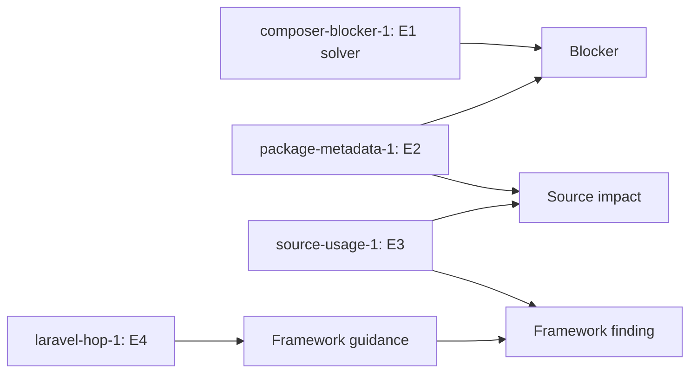

# Determinism and Evidence

PHP Upgrade Preflight tries to give the same modeled result when it sees the same inputs and observations. It sorts and normalizes the data it owns, then links report claims to evidence. Packagist, private repositories, caches, Composer versions, and the network can change between runs. The report records relevant uncertainty around those inputs.

## Why this matters

Stable fields and ordering help automation compare reports. Evidence links let a reviewer inspect a finding. Recorded Composer and platform provenance helps a developer explain why two otherwise similar runs differ.

## Four different ideas

| Idea | Meaning |
| --- | --- |
| Determinism | Equivalent controlled inputs and observations produce stable modeled output |
| Reproducibility | Another run can recreate sufficiently equivalent inputs and environment |
| Evidence | A structured record supporting a report claim |
| Confidence | How directly the available evidence supports that claim |

A heuristic can be applied consistently and still be tentative. A clear solver result can change when repository metadata changes. Reproducing an `unknown` result is possible too.

## Evidence classes

`Evidence` defines five classes.

| Class | Constant | Typical source | Example |
| --- | --- | --- | --- |
| E1 | `E1_SOLVER` | Composer solver/execution evidence | A reproducible dependency conflict |
| E2 | `E2_PACKAGE_METADATA` | Composer manifest or lock metadata | Locked version or root requirement |
| E3 | `E3_PROJECT_SOURCE` | Parsed project source | Symbol use at a file and line |
| E4 | `E4_MAINTAINER_DOCUMENTATION` | Maintained adapter knowledge with sources | Laravel upgrade-guide requirement |
| E5 | `E5_HEURISTIC` | Deterministic inference | Risk or planning hint based on modeled signals |

These labels answer different questions: class names the source, confidence describes how well it supports the claim, and severity describes the possible impact. E1 is not automatically more severe than E5.

## Evidence object

Every evidence item contains:

```json
{
  "id": "example-1",
  "class": "E2",
  "summary": "The lock file contains vendor/package 1.4.0.",
  "confidence": "high",
  "context": {
    "package": "vendor/package",
    "version": "1.4.0"
  }
}
```

This is the shape from `Evidence::toArray()`. Construction redacts summaries and context before another service can serialize them.

## Evidence ledger

One `EvidenceLedger` registers evidence for an analysis. `add()` creates an item in a namespace matching:

```text
^[a-z][a-z0-9_-]*$
```

IDs are namespace plus sequence.

```text
composer-blocker-1
composer-blocker-2
laravel-stage-target-1
```

Each namespace has its own sequence. The ledger skips an ID if it is already registered.

## `add()` versus `addOnce()`

Use `add()` when separate observations deserve separate evidence records.

Use `addOnce()` when content-identical evidence in one namespace should be reused.

`addOnce()` compares:

- evidence class
- summary
- confidence
- context
- namespace prefix.

It uses a SHA-256 bucket to narrow the search, then checks candidate values with strict equality. If serialization fails, it scans the namespace instead. The choice changes search cost, not what counts as equal.

## Evidence ID stability

Evidence IDs depend on creation order within their namespace. Inserting an earlier item can renumber later ones.

Therefore:

- iterate inputs in deterministic order
- use focused namespaces
- avoid creating unused evidence
- do not treat an evidence ID as a permanent database identity across schema changes.

Within one report, an ID is an exact link from a claim to its evidence.

## Reference integrity

`EvidenceLedger::validateReferences()` checks both directions: every cited ID exists, and every registered item is cited. An item with no claim to support is an orphan and fails report construction.

`UpgradeReport` gathers references from:

- blockers
- source inventory
- actionable source impact
- framework findings
- framework guidance and hops
- root constraint changes
- staged resolution
- plan stages
- uncertainties that contain explicit evidence references.

The ledger therefore shows which observation supports which claim.

## Example evidence graph


```mermaid
flowchart LR
    E1[composer-blocker-1: E1 solver] --> B[Blocker]
    E2[package-metadata-1: E2] --> B
    E3[source-usage-1: E3] --> I[Source impact]
    E2 --> I
    E4[laravel-hop-1: E4] --> G[Framework guidance]
    G --> F[Framework finding]
    E3 --> F
```

An item may support several claims, and a claim may cite several items. Every registered item needs at least one connection.

## Ordering as part of determinism

PHP arrays preserve insertion order, so traversal order can appear in JSON. Services sort map-like inputs where they take ownership of them.

Examples include:

- package names in `LockDiffBuilder`
- package families attached to changes
- installed integration names
- framework guidance
- source files in `SourceUsageScanner`
- symbol declarations
- autoload paths and files
- ownership names and mapping types
- relevant source-impact package maps
- provider names in stage-plan conflict handling
- platform decisions in fingerprints.

Filesystem enumeration and map-like Composer metadata need explicit ordering before they shape report lists.

## Lists versus maps

A map can be sorted by key. A list may carry priority or execution order, so sorting it could change the result.

Examples of meaningful list order:

- scenario order
- stage order
- attempt order
- package dependency path
- source occurrence order
- report section order.

Preserve those list orders when canonicalizing data.

## Scenario determinism

`ScenarioSelector` constructs candidates in a fixed order.

It then deduplicates by an execution key containing:

- normalized targets
- effective with-all-dependencies flag
- minimal-changes flag.

Baseline validation has its own fixed key.

Two display names do not justify two identical Composer runs.

## Candidate selection determinism

Successful target-feasibility candidates are ranked by:

1. package-change count
2. strategy rank
3. scenario index.

Strategy rank is exact target, then minimal changes, then with all dependencies.

The same successful candidates therefore select the same lock diff.

## Stable source scanning

`SourceUsageScanner` canonicalizes and sorts discovered file paths.

Visitors retain AST-derived line numbers and symbols.

`SymbolDeclarationVisitor` sorts declarations by symbol and type.

`AutoloadOwnershipIndexBuilder` sorts locked packages, paths, and files.

`SymbolOwnershipIndex` sorts owner names and mapping types.

Those sorts prevent directory iteration order from deciding report order.

## Cross-platform paths

The absolute checkout location should not appear in a shareable report.

`PathExposurePolicy` replaces relevant roots with markers:

| Marker | Meaning |
| --- | --- |
| `[PROJECT_ROOT]` | Analyzed project root |
| `[REPORT_OUTPUT]` | Requested report destination |
| `[LOCAL_REPOSITORY]` | Local Composer repository reference |
| `[ANALYZER_WORKSPACE]` | Temporary analyzer workspace |

It recognizes path separator variants, escaped forms, and encoded forms.

Longer matching paths are processed before shorter ones.

That order lets a specific path receive its own marker before its parent path is replaced.

## Canonical report sanitization

`UpgradeReport::toArray()` builds the canonical array.

It then calls `PathExposurePolicy::sanitizeCanonicalReport()`.

Sanitization:

1. identifies project, output, and local-repository paths
2. recursively replaces path occurrences
3. forces known project and output fields to markers
4. applies structured sensitive-output redaction.

Redaction covers keys and values, including safely traversed JSON-serializable objects. A recursive object cycle gets a marker instead of an endless walk.

## Sensitive-value determinism

`SensitiveOutputRedactor` uses stable markers.

Examples are:

- `[REDACTED]`
- `[REDACTED_TOKEN]`
- `[REDACTED_URL]`
- `[REDACTION_FAILED]`.

It recognizes Composer auth assignments, authorization headers, credential-bearing URLs, named credential fields, bearer/basic tokens, and common token formats.

Known sensitive keys cause their values to be withheld. If a redaction pattern fails, the redactor returns a failure marker instead of the original text.

## Bounded external output

Composer stdout and stderr can be large and may contain secrets. `OutputExcerpt::bounded()` keeps excerpts within a byte budget without splitting UTF-8 characters. The shorter excerpt still needs redaction.

## Candidate lock evidence

`CandidateLockFileReader` hashes Composer's candidate lock bytes after normalizing CRLF and CR to LF. A line-ending convention alone then does not change the SHA-256 fingerprint.

`CandidateLockEvidence` records:

- lowercase SHA-256
- Composer `content-hash` when present
- package count.

The byte fingerprint identifies the written lock content. Parsed package data describes what changed.

## Project-state fingerprints

`ProjectStateFingerprint` identifies state used between staged analyses.

It records SHA-256 values for:

- manifest
- lock
- effective platform
- execution policy
- combined state.

Before hashing, it hides private paths, sorts map keys recursively, keeps meaningful list order, normalizes separators after path markers, and excludes the lock's `content-hash` from the semantic lock digest.

## Why lock `content-hash` is excluded there

Core resolves relative local repositories to absolute paths inside a temporary manifest. Composer's derived lock `content-hash` can then depend on that workspace location. The manifest has its own semantic fingerprint, so including the derived hash in staged state identity would make equivalent states look different. Candidate lock evidence still records the value Composer wrote.

## Platform fingerprinting

The platform digest includes:

- exact analysis PHP
- whether the profile is closed-world
- explicit semantic platform decisions.

Platform package decisions are sorted by package name.

For a complete profile, closed-world state already expresses absence for supported packages. The digest can omit those repeated absent entries without changing the modeled platform.

## Report serialization

`JsonReportWriter` calls `UpgradeReport::toArray()`.

It encodes with:

- pretty printing
- unescaped slashes
- exceptions on encoding failure
- one trailing newline.

`UpgradeReport` controls top-level field order, and `ReportMetadata::SCHEMA_VERSION` identifies the schema. Consumers should check that version before interpreting fields.

## Markdown projection

`MarkdownReportWriter` presents the canonical report for readers. It runs no Composer or adapter rules. If Markdown and JSON reach different conclusions, the writer has a bug. JSON and its schema define the contract.

## Controlled and uncontrolled variables

| Variable | Controlled or recorded? |
| --- | --- |
| Normalized request | Controlled by model validation |
| Scenario order | Controlled by selector |
| Source file order | Controlled by scanner sorting |
| Composer executable/version | Configured and version evidence recorded when available |
| Repository metadata at a point in time | External and subject to change |
| Network availability | External, with restricted mode able to remove it intentionally |
| Private repository credentials | External and redacted |
| Host extension set | Not accepted as target truth unless represented by request/profile evidence |
| Temporary path | Normalized in shareable output |
| External process duration | Recorded but inherently variable |

Even identical requests can produce different reports when an external input changes.

## Reading a changed report

When two runs differ, compare in this order:

1. `metadata.schema_version` and tool version
2. normalized request summary
3. Composer execution provenance
4. platform provenance
5. scenario outcomes and Composer version
6. candidate lock fingerprint and package count
7. project-state fingerprints for stages
8. uncertainties
9. evidence contexts
10. final findings and assessments.

Start with inputs and observations. A changed risk label may be the last effect in a longer chain.

## Example: repository changed

Run A resolves `vendor/package` to `2.1.0`. Run B resolves it to `2.1.1` under the same request. The repository may have changed between runs. Candidate lock fingerprints show that the observed result changed. Reproducing either run requires control of repository content outside the analyzer.

## Example: same project in another directory

One developer analyzes `/home/alex/shop`, and another analyzes `D:\work\shop`. Shareable reports use `[PROJECT_ROOT]`, and staged fingerprints normalize separators after path markers. The checkout location alone should not change semantic state. Debug mode intentionally exposes exact paths, so debug reports can differ.

## Example: restricted mode

Compatible mode may resolve a package using cached credentials and network access while restricted mode cannot fetch it. Those are different execution policies, and provenance or fingerprints should show the difference. Missing repository access is an operational gap, not a dependency conflict.

## Confidence guidance

`high` means direct support for the modeled statement. `medium` means useful support with material limits. `low` marks a tentative conclusion. Read the evidence context and uncertainties with the label. None is a percentage or a reason to ignore contradictory evidence.

## Uncertainty as evidence discipline

Core records uncertainty when it cannot support a stronger conclusion.

Examples include:

- Composer executable unavailable
- scenario timeout
- source parse failure
- unreadable candidate lock
- incomplete platform evidence
- current PHP unknown for a diagnostic scenario
- adapter rule exception
- stage guidance gap
- workspace cleanup failure.

That explicit gap is more useful than a guessed answer that appears precise.

## Contributor rules

- Sort map-like external input before iteration.
- Preserve meaningful list order.
- Normalize paths before hashing or sharing.
- Use stable vocabulary constants.
- Create evidence at the observation boundary.
- Reference every created evidence item.
- Never reference an unregistered ID.
- Deduplicate only when semantic equality is proven.
- Keep external failures distinct from solver findings.
- Add snapshot tests when canonical output changes.
- Add cross-platform tests for path or fingerprint changes.
- Update schema and Wiki in the same behavior change.

## Review checklist for a new evidence type

1. Is the evidence class correct?
2. Is the namespace valid and specific?
3. Is creation order stable?
4. Is summary concise and factual?
5. Is context structured rather than embedded prose?
6. Are secrets and paths sanitized?
7. Does a report claim reference the ID?
8. Could identical observations use `addOnce()`?
9. Are confidence and severity kept separate?
10. Are schema and snapshots updated if shape changes?

## Review checklist for deterministic output

1. Is the input a list or a map?
2. If map-like, where is sorting owned?
3. If list-like, is order semantically documented?
4. Can filesystem order leak into output?
5. Can an absolute path leak into a digest?
6. Can line endings change a fingerprint?
7. Can external process noise change a stable field?
8. Is variable evidence recorded as provenance or uncertainty?
9. Does JSON retain canonical authority?
10. Do tests cover at least two input orderings?

## Related pages

- [[Architecture Overview|Architecture-Overview]]
- [[Core Package Guide|Core-Package-Guide]]
- [[Core Analysis Pipeline|Core-Analysis-Pipeline]]
- [[Core Service Reference|Core-Service-Reference]]
- [[Key Concepts|Key-Concepts]]
