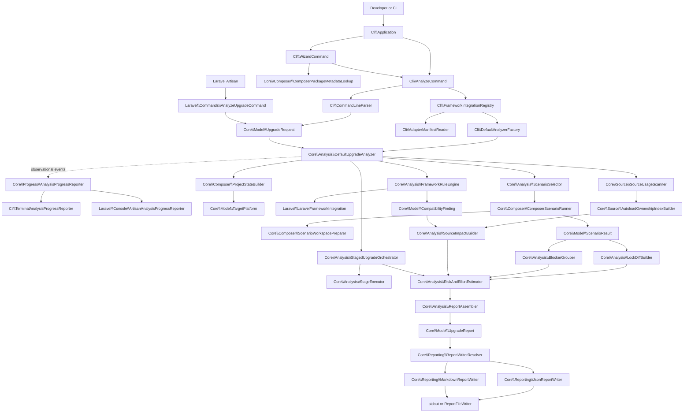

# Architecture Overview

PHP Upgrade Preflight is a read-only analysis system.

It answers planning questions about a requested PHP or Composer upgrade.

It does not edit the analyzed project.

It does not run the application.

It does not prove runtime compatibility.

## Audience

Junior developers can use this page to find where a behavior lives.

Technical managers can use it to understand system boundaries, evidence quality, and operational risk.

For a package-by-package index, see [Package Map](https://github.com/ValentinNikolaev/php-upgrade-preflight/wiki/Package-Map).

For a class lookup, see [[Core Service Reference|Core-Service-Reference]].

## System context

The repository contains three production packages and two fixture packages.

| Package | Architectural role |
| --- | --- |
| `php-upgrade-preflight/core` | Framework-neutral analysis engine and report model |
| `php-upgrade-preflight/cli` | Generic command-line boundary and adapter discovery |
| `php-upgrade-preflight/laravel` | Laravel knowledge, source visitors, stages, and Artisan integration |
| `php-upgrade-preflight/test-adapter` | Current third-party adapter contract fixture |
| `php-upgrade-preflight/legacy-test-adapter` | Older adapter capability fixture |

Dependency flow points toward Core.

Core never imports Laravel classes.

Adapters import Core interfaces and models.

## End-to-end pipeline

The following Mermaid diagram uses the real production class names.



The diagram is a dependency flow, not a promise that every optional branch runs.

For example, no active stage provider means staged analysis is skipped.

## Layer 1: delivery boundaries

There are three user-facing command flows over two executables.

The generic executable offers automation-safe `upgrade-intel analyze` and terminal-only `upgrade-intel wizard` flows. `Cli\Application` dispatches them. `Cli\AnalyzeCommand` owns explicit option parsing and delivery; `Cli\WizardCommand` collects choices, validates optional package metadata, prints the equivalent explicit command, and delegates back to the same analyzer command.

Its controller is `Cli\AnalyzeCommand`.

The Laravel command is `php artisan upgrade:analyze`.

Its controller is `Laravel\Commands\AnalyzeUpgradeCommand`.

The standalone analysis and Artisan controllers perform the same broad work:

1. Parse command input.
2. Construct validated model objects.
3. Delegate to `UpgradeAnalyzer`.
4. Select a report writer.
5. Print or write the rendered report.

They do not parse Composer conflicts.

They do not calculate risk.

They do not contain Laravel transition rules.

This keeps presentation concerns outside the analysis engine.

Terminal progress follows the same boundary. Core emits validated observational events through `AnalysisProgressReporter`; CLI and Laravel render them to terminal-attached stderr. Non-TTY execution stays silent, and progress reporter failures cannot affect the canonical report.

## Layer 2: request model

`UpgradeRequest` is the validated boundary between delivery and analysis.

It contains:

- project path;
- package targets;
- current PHP evidence;
- target PHP;
- source paths;
- requested frameworks;
- report format and output path;
- debug mode;
- extension assumptions;
- optional target-platform profile;
- Composer execution configuration.

`UpgradeTargetSet` normalizes package and PHP targets.

Duplicate package names must not contradict one another.

Target PHP from different inputs must agree exactly after normalization.

Source paths must resolve inside the analyzed project.

## Layer 3: project state

`ProjectStateBuilder` loads `composer.json` and `composer.lock`.

`JsonFileReader` provides strict JSON-object validation.

The result is a `ProjectStateLoadResult`.

Success contains a `ProjectState`.

Failure contains a typed exception and enough partial state to build a terminal report.

Input failure is modeled rather than confused with a solver conflict.

## Layer 4: target platform

`TargetPlatform::fromRequest()` combines request evidence and project Composer metadata.

It can represent PHP, extensions, target profile packages, and provenance.

Platform provenance matters because host state and explicit target state are not interchangeable.

An explicit extension assumption is evidence supplied by the caller.

It is not proof obtained by booting the target environment.

## Layer 5: adapter activation

The generic CLI discovers adapter classes from installed Composer manifests.

`AdapterManifestReader` reads:

```json
{
  "extra": {
    "php-upgrade-preflight": {
      "framework-adapters": ["Vendor\\Adapter\\Integration"]
    }
  }
}
```

`FrameworkIntegrationRegistry` instantiates valid no-required-argument integrations.

It rejects duplicate classes and duplicate case-insensitive integration names.

`FrameworkRuleEngine` chooses active integrations.

An explicit `--framework=name` activates only requested available names.

Without explicit names, project detection decides activation.

## Layer 6: direct Composer scenarios

`ScenarioSelector` creates a bounded scenario matrix.

The usual scenarios are:

- baseline validation;
- exact target;
- target with all dependencies;
- minimal changes.

PHP plus package requests may add platform-only and staged-target diagnostic scenarios.

`ComposerScenarioRunner` executes each selected scenario.

It uses `TemporaryWorkspaceManager` and `ScenarioWorkspacePreparer`.

The analyzed tree remains untouched.

Each scenario returns a `ScenarioResult`.

A result can contain:

- exit code;
- bounded stdout and stderr;
- duration;
- Composer version;
- failure classification;
- diagnostics;
- candidate lock state;
- candidate lock evidence;
- debug workspace path.

## External-process boundary

Composer is an external process.

Its environment, version, repositories, cache, credentials, and network availability can affect results.

The report records relevant execution configuration and uncertainty.

Compatible mode uses normal Composer access with non-interactive/no-audit settings.

Restricted mode creates analyzer-owned Composer state and disables normal credential, proxy, prompt, and network paths where supported.

Restricted mode is not an operating-system sandbox.

## Layer 7: direct interpretation

`LockDiffBuilder` compares the baseline lock with the selected successful candidate.

`BlockerGrouper` converts reliable solver evidence into structured blockers.

`ComposerBlockerParser` helps extract package and constraint relations from Composer text.

`AbandonedPackageDetector` adds lock-metadata abandonment evidence.

The direct resolution can be:

- `feasible`;
- `feasible_with_changes`;
- `blocked`;
- `unknown`.

Unknown is not a softer spelling of blocked.

It means reliable solver evidence was not available.

## Candidate selection

The analyzer considers successful target-feasibility scenarios with readable candidate locks.

It first prefers fewer package changes.

For equal change counts, strategy rank is:

1. exact target;
2. minimal changes;
3. with all dependencies.

Original scenario order is the final tie-breaker.

This candidate drives the direct lock diff.

## Layer 8: staged analysis

Staged analysis is separate from direct resolution.

`StagedUpgradeOrchestrator` asks active `FrameworkStageTargetProvider` integrations for plans.

`StagePlanResolver` validates and selects a usable provider plan.

`StageAttemptPlanner` creates bounded attempts.

`StageExecutor` runs them.

`StageBlockerRegistry` tracks conflict lifecycle.

The selected candidate state of one successful stage becomes input to the next stage.

The application source tree is still not rewritten.

## Layer 9: source analysis

`SourceUsageScanner` parses selected PHP files using `nikic/php-parser`.

Core visitors collect common declarations and usages.

Adapters may add visitors through `SourceUsageVisitorProvider`.

The first product is source inventory.

Inventory is not automatically actionable impact.

`AutoloadOwnershipIndexBuilder` uses root and locked-package autoload metadata.

`SourceImpactBuilder` correlates inventory with ownership, package changes, and framework findings.

This reduces false attribution caused by matching a symbol name alone.

## Layer 10: framework guidance

Adapters supply maintained framework knowledge.

The Laravel adapter separates that knowledge into:

- `LaravelFrameworkDetector`;
- `LaravelRuleCatalog`;
- `LaravelRuleFactory`;
- `LaravelTransitionAssessor`;
- `LaravelStagePlanner`;
- `LaravelSourceUsageVisitor`.

Core sees interfaces and model values, not Laravel implementation details.

See [Laravel Package Internals](https://github.com/ValentinNikolaev/php-upgrade-preflight/wiki/Laravel-Package-Internals).

## Layer 11: assessment

`RiskAndEffortEstimator` consumes structured evidence.

Risk is a deterministic planning summary.

It is not a probability.

Effort is a range with confidence, components, and assumptions.

It is not a quotation or deadline.

`StageAssessmentBuilder` adds stage-level source impact, risk, effort, tests, and actions.

## Layer 12: report assembly

`ReportAssembler` is the single normal construction point for `UpgradeReport`.

`ReportSectionBuilder` creates normalized derived sections.

The report constructor validates evidence references and other invariants.

JSON is canonical.

Markdown is a projection of the same report object.

Writers do not rerun analysis.

## Trust boundaries

| Boundary | Untrusted or variable input | Main controls |
| --- | --- | --- |
| CLI | User-provided strings and paths | Parser and model validation |
| Project files | Composer JSON and PHP source | Strict readers, AST parser, contained uncertainties |
| Composer | External executable and output | Timeouts, safe command representation, classification, redaction |
| Adapters | Third-party classes and rules | Manifest validation, interface checks, exception containment |
| Reports | Paths, diagnostics, evidence context | Path markers, structured redaction, bounded excerpts |

## Failure containment

Not every failure ends the process.

A broken optional adapter manifest is skipped and diagnosed.

A throwing adapter rule becomes evidence-backed uncertainty while remaining rules continue.

A failing stage provider can be contained as unavailable staged analysis.

A PHP parse failure becomes source uncertainty.

An invalid command invocation exits before analysis.

An unreadable project input produces a terminal input-failure report when possible.

## Architectural invariants

- The analyzed project is not mutated.
- Candidate manifests and locks belong to analyzer workspaces.
- JSON is the canonical contract.
- Every registered evidence item must support a report claim.
- Framework-specific knowledge stays outside Core.
- Operational failure is not reported as a solver blocker.
- Unknown remains a first-class outcome.
- Stable ordering is deliberate, not accidental.
- Sensitive output is redacted before sharing.
- Debug mode weakens path hiding by explicit user choice.

## Example request path

```bash
vendor/bin/upgrade-intel analyze \
  --path=./shop \
  --target=laravel/framework:^13.0 \
  --from-php=8.2 \
  --target-php=8.3 \
  --framework=laravel \
  --format=json
```

The CLI constructs the request.

The registry supplies the Laravel integration.

Core loads Composer state and builds the target platform.

Direct scenarios test final-target feasibility.

The Laravel adapter can provide adjacent stage targets.

Core scans the original source snapshot.

The report combines direct, staged, source, and guidance evidence without conflating them.

## Where to read next

- [[Core Package Guide|Home]] for contributor workflows.
- [[Core Analysis Pipeline|Core-Analysis-Pipeline]] for a compact execution narrative.
- [[Core Service Reference|Core-Service-Reference]] for class ownership.
- [Determinism and Evidence](https://github.com/ValentinNikolaev/php-upgrade-preflight/wiki/Determinism-and-Evidence) for stability and traceability.
- [CLI Package Internals](https://github.com/ValentinNikolaev/php-upgrade-preflight/wiki/CLI-Package-Internals) for the generic command boundary.
