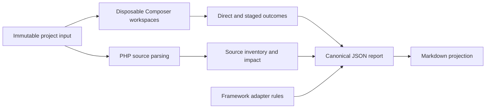

# PHP Upgrade Preflight

PHP Upgrade Preflight explains a Composer-based PHP or Laravel upgrade before anybody changes the analyzed project.

It answers practical questions such as:

- Can Composer resolve the requested final target?
- Which locked or root packages prevent resolution?
- What would change in a candidate lock file?
- Which source locations deserve review?
- Which Laravel migration rules apply to each supported hop?
- Can a multi-major Laravel path be solved one adjacent stage at a time?
- Which conclusions are proven, which are inferred, and which remain unknown?

It does this by treating the project as immutable input. The analyzer copies Composer manifests into disposable workspaces, runs Composer there with scripts and plugins disabled, parses PHP source, applies active adapter rules, and assembles evidence into a report.

> **Public beta:** the current published line is v0.3.x. The latest release recorded in the repository is v0.3.3, and its canonical report schema is 0.8.

## What problem it solves

A framework upgrade is not one question. Composer may reject the requested packages, accept them only after related dependencies move, or resolve a final target that still requires application code changes. A framework migration guide may cover a route that Composer cannot currently solve. A direct jump may fail while an adjacent staged path provides useful intermediate evidence.

PHP Upgrade Preflight keeps those conclusions separate. It gives developers and technical managers a reviewable picture without editing `composer.json`, rewriting `composer.lock`, or changing source files.

### Example decision

Suppose a Laravel 10 project is being evaluated for Laravel 13:

```bash
vendor/bin/upgrade-intel analyze \
  --path=/work/legacy-app \
  --from-php=8.1 \
  --target=laravel/framework:^13.0 \
  --target-php=8.3 \
  --framework=laravel \
  --format=json \
  --output=/work/reports/laravel-13.json
```

A valid report can say that direct resolution is `blocked`, Laravel guidance is `supported`, and staged resolution stopped at a later hop. Those statements are not contradictory: they answer different questions.

## Who should use it

### Developers evaluating an upgrade

Start with [[Getting Started|Getting-Started]], then use [[Reading the Report|Reading-the-Report]]. The fastest useful outcome is not “upgrade succeeded”; it is a concrete list of blockers, affected code, unknowns, and next checks.

### Contributors to the analyzer

Start with [[Architecture Overview|Architecture-Overview]], continue with [[Core Package Guide|Core-Package-Guide]], and finish with [[Contributing]]. The core is framework-neutral, and every reported claim must remain deterministic and evidence-backed.

### Framework adapter authors

Start with [[Writing a Framework Adapter|Writing-a-Framework-Adapter]], then compare the shipped implementation in [[Laravel Adapter Internals|Laravel-Adapter-Internals]]. Framework package families, source vocabulary, and migration guidance belong in the adapter, never in core.

### Technical managers

Read this page, [[Key Concepts|Key-Concepts]], and [[Reading the Report|Reading-the-Report]]. Pay particular attention to risk drivers, effort ranges, confidence, uncertainty, and the separation between direct and staged results.

## What the project does

- Reads `composer.json`, `composer.lock`, selected source paths, and adapter metadata.
- Runs baseline and target Composer scenarios in analyzer-owned workspaces.
- Produces structured scenario outcomes and diagnostics.
- Classifies `resolution.status` as `feasible`, `feasible_with_changes`, `blocked`, or `unknown`.
- Calculates a candidate lock diff when a usable candidate lock exists.
- Groups structured blockers while preserving evidence links.
- Builds framework-neutral source inventory and actionable source impact.
- Applies adapter-provided detection, rules, transitions, package families, and optional staged targets.
- Produces risk, effort, tests, actions, uncertainty, and evidence sections.
- Writes canonical JSON or a Markdown projection.

## What it explicitly does not do

- It does not edit the analyzed project.
- It does not run `composer update` in the analyzed project.
- It does not install candidate dependencies into the project.
- It does not run project scripts or Composer plugins.
- It does not execute the application or its test suite.
- It does not prove runtime compatibility.
- It does not guarantee deployment success.
- It does not apply framework migration instructions.
- It does not use AI to invent advice or fill evidence gaps.
- It is not an operating-system network sandbox.

The correct interpretation is “decision-support evidence,” not “permission to deploy.”

## Current scope

The Composer monorepo publishes three packages in lockstep:

| Package | Responsibility |
| --- | --- |
| `php-upgrade-preflight/core` | Framework-neutral analysis engine and report contract |
| `php-upgrade-preflight/cli` | The explicit `upgrade-intel analyze` command and interactive `upgrade-intel wizard` |
| `php-upgrade-preflight/laravel` | Laravel adapter and `upgrade:analyze` Artisan command |

All shipped packages have a PHP `^8.0` language/runtime floor. The separate tools-directory workflow allows that PHP 8 analyzer to inspect an older target project without requiring the target application to boot.

Laravel guidance covers 7→8, the retained direct 7→9 rule pack, and adjacent hops from 8→9 through 12→13. A rooted `laravel/framework` project can receive staged Composer evidence for a contiguous adjacent path. The direct final-target result remains independent.

## Status and compatibility

The v0.3.x line promises patch-level compatibility for documented CLI and Artisan behavior, required adapter interfaces and discovery metadata, exit policy, schema 0.8 compatibility, and supported transition/staged-analysis claims.

The 0.2.x and 0.1.x lines are archival. Their signed artifacts and schemas remain historical evidence, but the repository states that they receive no new features, bug fixes, or security fixes.

For authoritative details, read [project status](../docs/project-status.md), [versioning](../docs/versioning.md), and the [changelog](../CHANGELOG.md).

## A two-minute mental model



The JSON report is the source of truth. The Markdown writer renders that report and contains no independent analysis logic.

## Typical workflow

1. Install the analyzer separately or as a development dependency.
2. State exact targets and, where possible, explicit platform assumptions.
3. Run the interactive wizard, explicit CLI, or Artisan entry point.
4. Confirm a report was produced.
5. Read `resolution.status`, framework guidance status, and staged status independently.
6. Trace important findings through their evidence IDs.
7. Review uncertainties and trust boundaries.
8. Use the report to plan a real upgrade in a separate branch and run the application's own verification.

## Wiki map

### Learn the vocabulary

- [[Key Concepts|Key-Concepts]] explains targets, scenarios, blockers, evidence, uncertainty, risk, effort, and projections.

### Run the tool

- [[Getting Started|Getting-Started]] covers installation and a first report.
- [[CLI Reference|CLI-Reference]] documents every accepted standalone option.
- [[Artisan Command|Artisan-Command]] explains Laravel-hosted execution.
- [[Reading the Report|Reading-the-Report]] walks through schema 0.8.
- [[Safety and Trust Boundaries|Safety-and-Trust-Boundaries]] explains immutability, redaction, paths, credentials, and untrusted inputs.
- [[Troubleshooting and FAQ|Troubleshooting-and-FAQ]] maps symptoms to actions.

### Understand and change the code

- [[Architecture Overview|Architecture-Overview]] follows the pipeline.
- [[Core Package Guide|Core-Package-Guide]] maps namespaces to responsibilities.
- [[Determinism and Evidence|Determinism-and-Evidence]] explains stable output and honest unknowns.
- [[Report Schema|Report-Schema]] is the consumer-oriented schema guide.
- [[Contributing]] explains the test and quality gates.

### Extend it

- [[Writing a Framework Adapter|Writing-a-Framework-Adapter]] describes every adapter interface.
- [[Laravel Adapter Internals|Laravel-Adapter-Internals]] is the production example.

### Track the project

- [[Roadmap and Status|Roadmap-and-Status]] summarizes the point-in-time plan and release policy.

## First safety rule

Never place `--output` or `--save-report` inside the analyzed project. The tool rejects that destination because producing a report inside the input tree would violate its byte-for-byte immutability guarantee.

## Canonical references

- [README](../README.md)
- [Installation](../docs/installation.md)
- [CLI reference](../docs/cli.md)
- [Limitations and trust boundaries](../docs/limitations.md)
- [Schema and compatibility](../docs/schema.md)
- [v0.3 staged-analysis contract](../docs/v0.3-contract.md)
- [Contributing](../CONTRIBUTING.md)

## Next step

If you want to try the tool, continue to [[Getting Started|Getting-Started]]. If you need to explain a report to a team, continue to [[Reading the Report|Reading-the-Report]].

## Worked example: a feasible target

Assume a project requests a package target and Composer produces a usable candidate lock.

```bash
vendor/bin/upgrade-intel analyze \
  --path=. \
  --target=symfony/console:^7.0 \
  --target-php=8.2 \
  --format=json
```

The direct result can be `feasible` when a target-feasibility scenario succeeds and the selected candidate contains no package changes.

It can be `feasible_with_changes` when the selected candidate succeeds and contains package changes.

For a developer, the next step is to inspect `transition.package_changes`, source impact, and tests before creating an upgrade branch.

For a manager, the important point is that feasibility is solver evidence, not deployment approval.

The report still needs uncertainty, risk, effort, and application test review.

## Worked example: a blocked target

Suppose Composer consistently reports that a locked plugin requires an older framework range.

The report can contain:

```json
{
  "resolution": {"status": "blocked"},
  "blockers": [
    {
      "subject": "acme/legacy-plugin",
      "requested_constraint": "^13.0",
      "blocking_constraint": "^10.0"
    }
  ]
}
```

The exact blocker shape is controlled by schema 0.8; the abbreviated example highlights the decision path.

A developer should follow the blocker's scenario and evidence references.

The likely actions are to upgrade, replace, remove, or reconfigure the blocking dependency.

A manager should treat the blocker as a concrete scope item that needs ownership.

The blocker does not by itself predict the total delivery effort.

## Worked example: an unknown result

Unknown means evidence was insufficient for a reliable direct conclusion.

Common causes include:

- Composer executable unavailable;
- process timeout;
- restricted mode without required cached packages;
- unreadable or invalid project input;
- candidate lock evidence that could not be read;
- incomplete platform information.

The right response is to repair the evidence path and rerun.

Do not translate `unknown` to “probably compatible.”

Do not translate it to “definitely blocked.”

## How to brief a technical manager

A useful upgrade briefing can fit five questions:

| Question | Report area | Management interpretation |
| --- | --- | --- |
| Can the requested final state resolve? | `resolution.status` | Direct dependency feasibility |
| Is an adjacent migration route modeled? | `transition.framework_guidance` and `staged_resolution` | Planning coverage and intermediate evidence |
| What changes? | Package changes, root constraints, source impact | Concrete engineering scope |
| What remains unknown? | `uncertainties` and confidence | Validation debt and decision risk |
| What should happen next? | Plan stages, tests, risk, effort | Sequenced work, not an automatic upgrade |

Always state which Composer mode and target platform evidence produced the report.

Two reports created with different network, repository, Composer, or platform conditions may not be directly comparable.

## How a Junior developer should investigate a finding

Start with the human summary.

Then locate every evidence ID attached to the finding.

Read the evidence class:

- E1 is solver evidence;
- E2 is package metadata;
- E3 is project source;
- E4 is maintainer documentation encoded by an adapter;
- E5 is a heuristic.

Check confidence separately from severity.

Open the referenced project-relative source location when present.

Check whether the affected package actually changes in the selected candidate lock.

Read related uncertainties before proposing a fix.

Finally, verify the proposed change in a normal upgrade branch with the project's own tests.

## Choosing the right command entry point

Use `upgrade-intel wizard` for a guided local terminal session. It proposes PHP and package choices, distinguishes repository not-found from operationally unverified metadata, reviews the equivalent explicit command, and delegates to the same analyzer. It is not available for redirected or non-TTY automation.

Use `upgrade-intel analyze` when the analyzer is installed as a generic CLI tool or when multiple framework adapters may be installed.

Use `php artisan upgrade:analyze` when running from a Laravel application that has the Laravel package installed.

Both commands delegate to the same Core analyzer and produce the same canonical report model.

The Artisan command selects Laravel explicitly and defaults the project path from the application.

The generic CLI supports repeatable `--framework` selection and Composer-metadata adapter discovery.

See [[CLI Package Internals|CLI-Package-Internals]] and [[Laravel Package Internals|Laravel-Package-Internals]] for implementation details.

## What to preserve when sharing a report

Keep the JSON report unchanged as the canonical artifact.

Record the command and the analyzed Git revision outside the report when your workflow requires auditability.

Preserve `metadata`, request summary, platform provenance, Composer execution provenance, uncertainties, and evidence.

Do not remove an uncertainty merely to make a status look cleaner.

Do not paste retained debug workspaces into tickets without reviewing copied Composer metadata and credentials.

Use the Markdown projection for discussion, but return to JSON when automation or exact field interpretation matters.

## Release documentation reminder

Every release tag must ship with an updated Wiki view of the tagged behavior.

The required workflow is documented in [[Release Wiki Strategy|Release-Wiki-Strategy]].

Codex, Claude, and other coding agents must perform that update during release work rather than leaving it as later cleanup.
